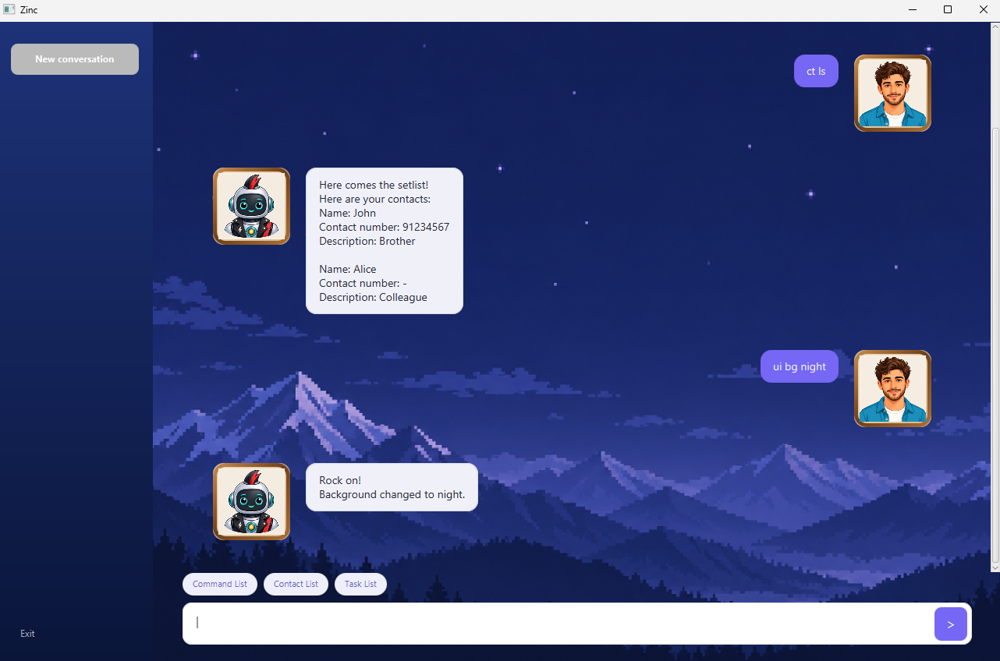

# Zinc

Zinc is a desktop task and contact manager built with Java and JavaFX. It uses a
command-based interface to keep everyday planning fast while providing a graphical
window, built-in help, and locally saved data.



## Features

- Create todos, deadlines, and events.
- Mark, unmark, delete, search, and filter tasks by date.
- Add, update, find, and delete contacts.
- Save tasks and contacts automatically between sessions.
- Open an in-app command reference with `help`.
- Choose a morning, evening, or night background, or let Zinc select one automatically.

## Requirements

- [JDK 25](https://www.oracle.com/java/technologies/downloads/)
- An internet connection for Gradle to download dependencies on the first build
- [IntelliJ IDEA](https://www.jetbrains.com/idea/) (optional, but recommended for development)

## Running Zinc

Clone the repository and open a terminal in its root directory:

```shell
git clone https://github.com/yeoznc/ip.git
cd ip
```

Run Zinc with the included Gradle wrapper:

| Operating system | Command |
| --- | --- |
| Windows | `gradlew.bat run` |
| macOS or Linux | `./gradlew run` |

The wrapper downloads the required Gradle version automatically, so a separate Gradle
installation is not needed.

### Running from IntelliJ IDEA

1. Open the repository directory in IntelliJ IDEA.
2. Set the project SDK to JDK 25 and the language level to **SDK default**.
3. Allow the Gradle project to finish importing.
4. Run `zinc.javafx.ZincLauncher.main()`.

## Command reference

Enter commands in the text field at the bottom of the Zinc window. Dates use
`DD/MM/YY`; times may use either `HHMM` or `HH:MM`.

### Tasks

| Action | Command |
| --- | --- |
| Add a todo | `todo <description>` |
| Add a deadline | `deadline <description> /by <DD/MM/YY> [HHMM or HH:MM]` |
| Add an event | `event <description> /from <DD/MM/YY> [HHMM or HH:MM] /to <DD/MM/YY> [HHMM or HH:MM]` |
| List every task | `list` or `ls` |
| List tasks ending on a date | `list <DD/MM/YY>` |
| Find tasks | `find <keyword>` |
| Mark a task as complete | `mark <task number>` |
| Mark a task as incomplete | `unmark <task number>` |
| Delete a task | `delete <task number>` |

### Contacts

| Action | Command |
| --- | --- |
| Add a contact | `contact add /n <name> [/p <8-digit contact number>] [/d <description>]` |
| Update a contact | `contact update <current name> [/n <new name>] [/p <8-digit contact number>] [/d <description>]` |
| List every contact | `contact list` |
| Find contacts by name | `contact list <name>` |
| Delete a contact | `contact delete /n <name>` |

Use `ct` instead of `contact` as a shorter alias. The `list` and `delete` contact
subcommands also accept the aliases `ls` and `del`, respectively.

### General

| Action | Command |
| --- | --- |
| Open the help window | `help` |
| Select a background | `ui background <morning\|evening\|night\|auto>` |
| Exit Zinc | `bye` |

Use `ui bg` as a shorter alias for `ui background`.

## Data storage

Zinc automatically stores tasks in `data/zincTasks.txt` and contacts in
`data/zincContacts.txt`. The `data/` directory is excluded by `.gitignore`, so personal
application data is not committed to the repository.

## Building and testing

Use the matching wrapper command for your operating system:

| Purpose | Windows | macOS or Linux |
| --- | --- | --- |
| Run all tests | `gradlew.bat test` | `./gradlew test` |
| Run tests and Checkstyle | `gradlew.bat check` | `./gradlew check` |
| Build the executable JAR | `gradlew.bat shadowJar` | `./gradlew shadowJar` |

The packaged application is created at `build/libs/zinc.jar`.
